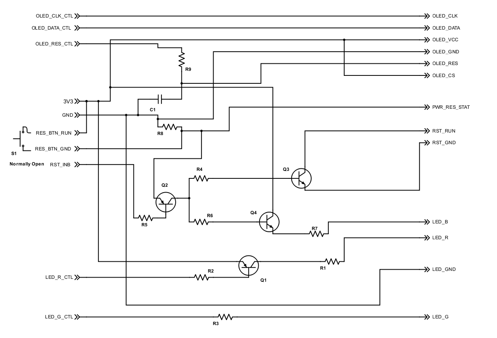

## Peripheral management circuitry
This circuitry forms an interface between the Raspberry Pi and the system's peripherals,
adding specific behaviour for handling the reset button and controlling the status LEDs.

### Requirements
The peripheral management circuitry behaviour is conceived to fulfill the following needs:

* First and foremost: provide user feedback
* Power off the system
* Restart the system
* Use a single LED and color codes to indicate status
* Wire up the circuitry required for the OLED Reset line.

### Behaviour

* When the system is inactive (either due to shutdown or after plugging it in), the LED should be red.
* When the system is booting into a usable state, or is shutting down, the LED should be yellow.
* When the system is operational, the LED should be green.
* When operational, the user should be able to shut down the system by holding the  **PWR\_RES** button for a minimum amount of time.
* When shut down, the user should be able to restart the system, without having to unplug it first, but again using the **PWR\_RES** button.
* When pressing this button, the LED should light up in purple as a confirmation that the system will be rebooted.

### The Circuit

(Circuit created using [Scheme-it][ref-scheme-it])

#### Connections
The circuit will be connected to the reset of the system:

*  **GPIO** pins on the Raspberry Pi. Note that the **BMC** numbering is used, **not** the BOARD numbering.
*  **P6** reset pins
*  Power button, a momentary switch.

##### Input pins

Name |	Description | Interface
--- | ---------- | ------
3V3 | Board power | GPIO 1
GND | Board power | GPIO 6
OLED\_CLK\_CTL | OLED I2C Clock | GPIO 3 (SCL)
OLED\_DATA\_CTL | OLED I2C Data | GPIO 2 (SDA)
OLED\_RES\_CTL | OLED Reset | GPIO 25
RES\_BTN\_RUN, RES\_BTN\_GND | Used to reset the circuit | Connected to [**PWR_RES**][ref-block-diagram], depicted as S1 in the schema.
RST\_INB | Reset Inhibit. Prevents the reset signal, shorting **RES\_BTN\_RUN** and **RES\_BTN\_GND** will *not* result in a reset of the system | GPIO 24 (together with **LED\_G\_CTL**)
LED\_G\_CTL | Controls the green LED. When high, the green led wil be *on*. | GPIO 24 (together with **RST\_INB**)
LED\_R\_CTL | Controls the red LED. When high, the red LED will be *off*. | GPIO 23

##### Output pins

Name | Description | Interface
---- | ----------- | ------
_OLED\_\<name\>_ | OLED connections | Connected to [**DISP**][ref-block-diagram].
PWR\_RES\_STAT | Goes high whenever [**PWR_RES**][ref-block-diagram] is being pressed. | GPIO 18
RST\_RUN, RST\_GND | When shorted, the Raspberry Pi will reset. | [P6.01 and P6.02 header pins, respectively](http://elinux.org/Rpi_Low-level_peripherals#P6_header).
LED\_R, LED\_G, LED\_B, LED\_GND |  Constitute the blue, red and green LEDS of and RGB LED. They can be combined to produce the additional colors yellow and purple | Connected to [**LED_RGB**][ref-block-diagram]

#### Power Status Operation
When the system is plugged in, **LED\_R\_CTL** will be low. **Q1** is saturated, causing the **LED\_R** to be activated (red status LED). As soon as the system boots, the system software will activate **LED\_G\_CTL**, resulting in an yellow status LED (red + green = yellow). It will also set **RST\_INB** high, causing **Q2** to cut off, so any current flow between **RES\_BTN\_RUN** and **RES\_BTN\_GND** is directed to towards **PWR\_RES\_STAT**. The latter is protected by a pull down resistor **R8** to prevent inadvert signals.

When the system has finished booting, the software will set **LED\_R\_CTL** high, cutting off **Q1**, thus deactivating **LED\_R**, resulting in a green status LED.

Software will monitor **PWR\_RES\_STAT**, provided **RST\_INB** is high. When pressed for more than three seconds, the system will set **LED\_R\_CTL** low, allowing current through **Q1**, and causing **LED\_R** to light up, resulting in a yellow status LED. The system will then initiate a shut down sequence.

At the end of the shut down sequence, the system will be in idle state, with  **LED\_R\_CTL**, **LED\_G\_CTL** and **RST\_INB** low, resulting in a red status LED and **Q2** in saturation. Pressing **PWR\_RES** will now allow a current flow towards **Q3** and **Q4**. The first will short **RST_RUN** and **RST_GND**, causing a system reboot, the second will light up the blue LED, causing a purple status LED (red + blue = purple), indicating feedback that the reset sequence will start.

#### Parts list

Part |	Description
--- | ------ 
R1, R4, R6 | 2k2 0.25W 
R2, R5 | 47k 0.25W
R3 | 15k 0.25W
R7 | 4k7 0.25W
R8 | 10k 0.25W
Q1, Q2 | BC556
Q3, Q4 | BC546
S1 | Momentary switch

Note: the resistors for the LEDs are tuned specifically to combine the best color combinations for the particular RGB LED I'm using.

#### The Prototype
With wires leading also to the Raspberry Pi GPIO (not depicted)

[ref-block-diagram]: diagrams/generated/BlockDiagram.png
[ref-scheme-it]: http://digikey.com/schemeit