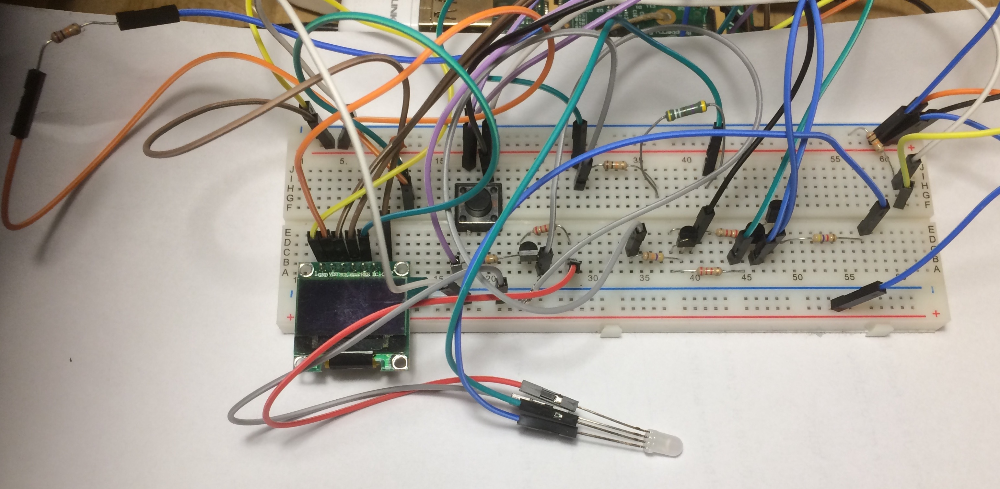

## Power management circuitry

### Requirements
The power management circuitry behaviour is conceived to fulfill the following needs:

* First and foremost: provide user feedback
* Power off the system
* Restart the system
* Use a single LED and color codes to indicate status

### Behaviour

* When the system is inactive (either due to shutdown or after plugging it in), the LED should be red.
* When the system is booting into a usable state, or is shutting down, the LED should be yellow.
* When the system is operational, the LED should be green.
* When operational, the user should be able to shut down the system by holding the  **PWR_RES** button for a minimum amount of time.
* When shut down, the user should be able to restart the system, without having to unplug it first, but again using the **PWR_RES** button.
* When pressing this button, the LED should light up in purple as a confirmation that the system will be rebooted.

### The Circuit

#### Connections

Name | In/Out |	Description
--- | ------ | ----------
PWR_BTN | in | Connected to **PWR_RES**, a momentary switch
RST_INB | in | Reset Inhibit. When high, pressing PWR_BTN will not result in a reset of the system
LED_R_CTL | in | Controls the red LED. When high, the red LED will be *off*. Connected to GPIO.
LED_G_CTL | in | Controls the green LED. When high, the green led wil be *on*. Connected to GPIO
PWR_BTN_IN | out | Detects whether **PWR_RES** is pressed. Connected to GPIO.
RST_RUN | out | Connected to P6.01 on the Raspberry Pi [P6 header](http://elinux.org/Rpi_Low-level_peripherals#P6_header).
RST_GND | out | Connected to P6.02 of the P6 header
LED_B, LED_R, LED_G | out | Constitute the blue, red and green LEDS of **LED_RGB**. They can be combined to produce the additional colors yellow and purple.

#### Operation
When the system is plugged in, **LED_R_CTL** will be low. **Q1** is saturated, causing the **LED_R** to be activated (red status LED). As soon as the system boots, the system software will activate **LED_G_CTL**, resulting in an yellow status LED (red + green = yellow). It will also set **RST_INB** high, causing **Q2** to cut off, so any current flow from **PWR_BTN** is directed to towards **PWR_BTN_IN**. The latter is protected by a pull down resistor **R8** to prevent inadvert signals.

When the system has finished booting, the software will set **LED_R_CTL** high, cutting off **Q1**, thus deactivating **LED_R**, resulting in a green status LED.

Software will monitor **PWR_BTN_IN**, provided **RST_INB** is high. When pressed for more than a three seconds, the system will set **LED_R_CTL** low, allowing current through **Q1**, and causing **LED_R** to light up, resulting in a yellow status LED. The system will then initiate a shut down sequence.

At the end of the shut down sequence, the system will be in idle state, with  **LED_R_CTL**, **LED_G_CTL** and **RST_INB** low, resulting in a red status LED and **Q2** in saturation. Pressing **PWR_BTN** will now allow a current flow towards **Q3** and **Q4**. The first will active the P6 header causing a system reboot, the second will light up the blue LED, causing a purple status LED (red + blue = purple), indicating feedback that the reset sequence will start.

#### Parts list

Part |	Description
--- | ------ 
R1 | 15k
R2, R5 | 47k 0.25W
R3 | 15k 0.25W
R4, R6 | 2k2 0.25W 
R7 | 4k7 0.25W
R8 | 10k 0.25W
Q1, Q2 | BC556
Q3, Q4 | BC546

Note: the resistors for the LEDs should not strictly form part of the circuitry, but are tuned specifically to combine the best color combinations for the particular RGB LED I'm using.

#### The Prototype
With wires leading also to the Raspberry Pi GPIO (not depicted)

