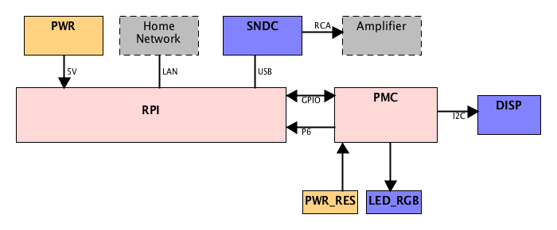

# nemo

## The Concept

Welcome to Nemo, the **ne**tworked **m**usic b**o**x. The project describes my efforts to create a homebrew UPnP renderer, with the following goals:

* Produce a simple device, to extend my already [existing][ref-tuner] [stack][ref-cdplayer] of [Technics][ref-amplifier] [gear][ref-equalizer] (no need yet for an AV Receiver)
* Give the Raspberry Pi I have lying around a home
* Brush up my electronics skills

### UPnP

[UPnP][ref-upnp] stands for Universal Plug and Play and is the technology that underpins [DLNA][ref-dlna] , which lets you stream media between devices connected in your home network, and that comes with virtually any audio or TV equipment you can buy nowadays.

UPnP has a notion of three logical components:

* a Media Server holding audio, video, photo's, etc.
* a Renderer, reproducing content from the Media Server
* a Control Point controlling the Renderer and the Media Server 

### Context
The following diagram illustrates the UPnP context in which Nemo operates. A [smartphone app][ref-app] (the Control Point) selects a song from the music library on the [NAS][ref-nas] (the Media Server) and instructs Nemo (the Renderer) to reproduce it.

- - -

- - -

## The Requirements
Nemo is conceived to fulfill the following needs:

* Repurpose my [Raspberry Pi model B][ref-pi]
* Good enough audio quality, but at least better than what's [built-in][ref-pi-audio]
* The ability to gracefully power off the device (orderly shutdown of the [system software][ref-raspbian]). Although the Pi [draws relatively little power][ref-pi-power], it makes no sense to leave it on 24/7 when not in use.
* Feedback about operational state (booting, playing, powering off). A user should be able to see what's going on.
* [RCA][ref-rca-jack] jack to connect it to standard stereo equipment.
* LAN connection to easily hook it up to the home network (no Wi-Fi configuration troubles)

## The Design
### Hardware
The following schematic illustrates the high level hardware design.
- - -

- - -
The following components are used:

**RPI** - Raspberry Pi 1 Model B. The core of the system.

**PWR** - 5V power supply.

**DISP** - A [128x64 pixel OLED][ref-oled] for displaying song and artist information

**SNDC** - An [external USB sound card][ref-usb-sound], for "good enough" quality audio

**PWR_RES** - The power and reset button.

**LED_RGB** - Status LED for system feedback, with support for red, yellow, green and purple colors. A single [RGB LED][ref-led] neatly fulfills this function.

**PMC** - The [Peripheral Management Circuitry](PMC.md), interfaces with the **RPI** and is responsible for handling the LEDs, power button and the OLED display.

### Software
For this project to succeed at all, the Raspberry Pi will have to have a basic
setup that allows playing music through UPnP / DLNA. My acknowledgements go to
Stephen C. Phillips, who [provides a thorough explanation on his website][ref-scphillips] on how to achieve this.

The following diagram shows how the main software components are deployed.
- - -

- - -
**gmediarender** is the [core program][ref-gmrender-resurrect] written by Henner Zeller that handles the UPnP discovery and media rendering. Instructions for getting it to work can be found on [Stephen's website][ref-scphillips], mentioned earlier.

**upnp-display** is based on [upnp-display][ref-upnp-display] (also by Henner). It listens to UPnP events and displays them on an LCD. It has been [modified][ref-upnp-display-mine] in order to publish to _inbus_.

**inbus** is a [minimalistic message broker][ref-inbus] that allows messages
to be distributed among different components.

**power** observes the GPIO keys and sends the events to _inbus_.

**display** subscribes to events coming from _power_ and _upnp-dispay_ and renders the currently playing song and artist on the OLED display. It uses 
[luma-oled][ref-luma-oled] by Richard Hull to do the rendering.

Please refer to [Installation](dist/INSTALL.md) for more details.

## Final Result
The casing is a repurposed digital receiver, sourced in the local thrift store for a couple of euros.

### The innards
After ripping out the main board, I was left with very handy power supply, providing a clean 12V and 5V, or so I thought. Unfortunately it made a strange clicking noise. Digital electronics is a nice enough challenge;
messing around with high voltage circuitry is a bridge too far. That's why
I opted for the high-tech solution currently in use.

### Final result...

... or almost. The lid has to be screwed on, but that's it.

The wires from the PMC are connected to the LED, OLED and PWR button, mounted on
top of the detachable front panel.

Thanks for reading!

[ref-upnp]: http://en.wikipedia.org/wiki/Universal_Plug_and_Play
[ref-dlna]: http://www.dlna.org
[ref-amplifier]: http://www.hifiengine.com/manual_library/technics/su-x955.shtml
[ref-equalizer]: http://www.hifiengine.com/manual_library/technics/sh-e66.shtml
[ref-tuner]: https://www.hifiengine.com/manual_library/technics/sl-pj27a.shtml
[ref-cdplayer]: http://www.hifiengine.com/manual_library/technics/st-x933l.shtml
[ref-nas]: http://www.synology.com/en-us/products
[ref-app]: http://itunes.apple.com/us/app/ds-audio/id321495303?mt=8
[ref-pi]: http://www.raspberrypi.org/products/model-b/
[ref-pi-audio]: http://raspberrypi.stackexchange.com/questions/3626/how-to-get-better-audio-quality-from-audio-jack-output
[ref-raspbian]: http://raspbian.org
[ref-pi-power]: http://www.pidramble.com/wiki/benchmarks/power-consumption
[ref-rca-jack]: http://www.lifewire.com/rca-jack-definition-3134804
[ref-usb-sound]: http://www.google.nl/search?q=HDE+7.1+channel+booster
[ref-oled]: http://www.google.nl/search?q=128x64+OLED
[ref-led]: http://www.google.nl/search?q=diffused+RGB+LED+5mm
[ref-upnp-display]: http://github.com/hzeller/upnp-display
[ref-upnp-display-mine]: http://github.com/mlos/upnp-display
[ref-gmrender-resurrect]: http://github.com/hzeller/gmrender-resurrect
[ref-inbus]: http://github.com/mlos/inbus
[ref-scphillips]: http://blog.scphillips.com/posts/2014/05/playing-music-on-a-raspberry-pi-using-upnp-and-dlna-v3/
[ref-luma-oled]: http://github.com/rm-hull/luma.oled